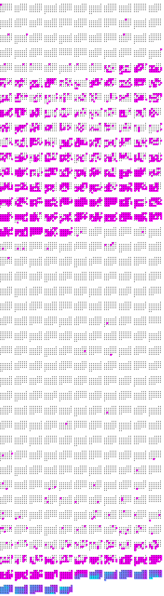
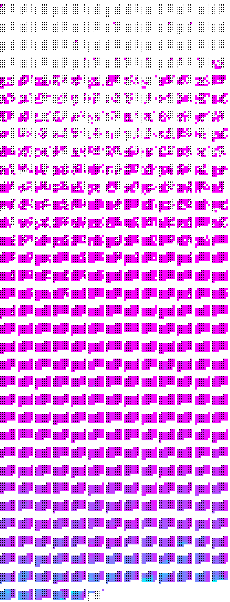
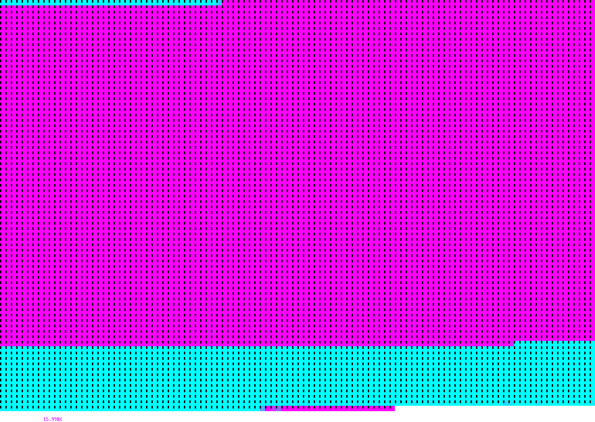

Firehose
========

*Scan the arXiv firehose; build your reading lists.*

Firehose is a small command-line tool for keeping up with arXiv. It maintains a
local index of every paper posted to the categories I follow, then streams their
abstracts past me one at a time so I can triage the day's papers at speed —
saving the interesting ones to my reading lists and grabbing PDFs as I go. As a
bonus, it draws pretty pictures of how much of the firehose I've actually read.

This is a personal research tool, shaped tightly around my own workflow and
shared in case it's useful to someone else. It isn't on PyPI and I make no
promises of support, but the code is small and hackable.


Installation
------------

Firehose needs Python 3.11+ (it uses `tomllib`). Clone the repo and install it
into a virtual environment:

```
git clone https://github.com/matomatical/firehose
cd firehose
pip install -e .          # or: uv venv && uv pip install -e .
```

This pulls in a handful of small dependencies plus
[matthewplotlib](https://github.com/matomatical/matthewplotlib) (my terminal
plotting library, installed straight from GitHub) for the visualisations.

**Optional system tools.** Two features shell out to standard platform tools and
degrade gracefully when they are missing:

* *Clipboard* (used by `sample` to hand saved papers to your reading list):
  `pbcopy` on macOS (built in); `wl-copy`, `xclip`, or `xsel` on Linux. With none
  available — e.g. a headless box — saves and downloads still work, you just
  don't get the line on your clipboard.
* *Opener* (used by `sample` to open a paper in your browser): `open` on macOS,
  `xdg-open` on Linux. Without one, the URL is printed instead.


The daily workflow
------------------

1. **`firehose harvest`** — refresh the local index with any new papers (a few
   seconds, once you're caught up).
2. **`firehose sample`** — scan the latest unread abstracts. Press `s` to save a
   paper, or `d` to also download its PDF; the matching reading-list line lands
   on your clipboard.
3. **Paste** each saved line into your reading list. (I keep mine in
   [legenda](https://github.com/matomatical/legenda); any Markdown file works.)
4. **`firehose calendar` / `linear` / `hilbert`** — admire your progress.


Configuration
-------------

Everything is configured in `config.toml`, which ships with sensible defaults
and is self-documenting. There are no hidden code-side defaults — every key in
the shipped file must be present — so the easiest way to start is to edit the one
that's already there. Three tables:

* `[arxiv].categories` — the categories you subscribe to, as arXiv OAI
  "setSpecs" in colon form (e.g. `cs:cs:AI`, `stat:stat:ML`). Lines you comment
  out stay in the file as a menu of categories you *could* follow. Run
  `firehose classes` to print arXiv's full catalog of setSpecs and names.
  Changing this list means re-running a full harvest.
* `[paths]` — `data` (where the index and logs live; default `data/`) and
  `downloads` (where grabbed PDFs are filed). Both expand `~`.
* `[scan].modern_cutoff` — a date. By default `sample` only shows papers
  submitted *after* this date (roughly when I started using firehose); pass
  `--no-modern` to include everything.

Any path can be overridden for a single run with `--data-dir` / `--download-dir`,
and a different config file with `--config-path`.


Commands
--------

### `harvest` — build the index

`firehose harvest` creates and updates `data/arxiv.txt`: the id and submission
date of every paper in your subscribed categories. Entries are grouped by date,
to keep the file small and greppable:

```
latest datestamp: 2026-03-05
1990-01-01:
cs/9301111
1991-08-01:
cs/9301113
...
2026-03-05:
2603.04402
2603.04417
```

Firehose uses arXiv's
[Open Archives Initiative (OAI-PMH)](https://info.arxiv.org/help/oa/index.html)
API rather than the regular web API: it returns 3,500 records per request, which
is much faster — but the *first* run still takes a few hours to chew through
arXiv's enormous backlog. After that, daily runs take seconds.

The long first harvest can crash. On a keyboard interrupt — or an exception I've
anticipated — it saves its progress and can simply be restarted. There's a
persistent crash somewhere around 2006 that I never got to the bottom of; if you
hit it, restart from a few days earlier. If you hit a *new* crash, well, sorry —
catch it and send a patch.

### `sample` — scan abstracts

`firehose sample [N]` downloads metadata for the latest `N` unread papers
(default 100) and presents them one at a time. Each paper shows its title,
authors, categories, abstract, and any comment, with a progress bar and a live
"seconds per paper" dwell timer along the top.

<!-- TODO: screenshot of the sample UI (capture on a machine with a real terminal). -->

Controls:

| key         | action                                                          |
|-------------|-----------------------------------------------------------------|
| `→` / `←`   | next / previous paper                                           |
| `↑` / `o`   | open the paper's abstract page in your browser                  |
| `s`         | **save** ☆ — copy `- ? Author+Year Title` to the clipboard      |
| `d`         | **download** ★ — copy `- Author+Year Title` *and* fetch the PDF  |
| `↓`         | progressive: unmarked → save → download                         |
| `x`         | undo the save/download on this paper (deletes a grabbed PDF)     |
| `space`     | pause / resume the dwell timer                                  |
| `q` / `esc` | quit                                                            |

A `☆` or `★` in the top-right shows whether you've saved or downloaded the
current paper. Simply advancing to a paper marks it read, so it won't appear in
future samples.

**Saving to a reading list.** Save and download don't file papers for you; they
put a Markdown list line on your clipboard, to paste wherever you keep your
reading list:

* `s` (save) copies `- ? Author+Year Title` — the `?` is my convention for "want
  to read, still need to get hold of it".
* `d` (download) copies `- Author+Year Title` and saves the PDF under
  `downloads/<YYYY-MM>/`, so the line means "want to read, already have it".

I paste these into [legenda](https://github.com/matomatical/legenda), where `-`
means to-read and `- ?` means to-read-but-remote — but any Markdown list works;
strip the markers if they aren't your thing.

**Choosing what to scan.** By default `sample` shows the newest unread papers
first. Some flags change the selection:

| flag                 | effect                                                      |
|----------------------|-------------------------------------------------------------|
| `firehose sample 50` | scan 50 papers instead of 100                               |
| `--no-modern`        | include papers older than `[scan].modern_cutoff`            |
| `--backwards`        | oldest unread first, instead of newest                      |
| `--randomise`        | a random sample of unread papers                            |
| `--no-query`         | just show the selection's date calendar; don't hit the API  |

Every view, save, download, and removal is also appended as a timestamped event
to `data/scanlog.jsonl`, for later analysis.

### `classes` — list arXiv categories

`firehose classes` prints arXiv's full catalog of category setSpecs and names
(fetched live), to help you fill in `[arxiv].categories`. arXiv's taxonomy is
effectively frozen, so you'll rarely need it.

### Visualising your reading

Firehose renders its index and read log as terminal graphics (via
[matthewplotlib](https://github.com/matomatical/matthewplotlib)). `calendar`,
`linear`, and `days` can each write a PNG with `--save-as out.png`.

**`calendar`** — a heatmap of your reading by date. `--mode read-date` (default)
colours the days you *scanned* papers; `--mode submit-date` (below) colours the
submission dates of papers you've read; `--mode proportion` shows what fraction
of each day's papers you've seen.



**`days` / `months` / `years`** — `days` draws the same kind of heatmap over the
submission dates of *every* indexed paper — a nice picture of arXiv's growth in
your categories — while `months` and `years` print plain-text counts.



**`linear`** — your progress through the entire index, in batches of 100 papers,
with the total percentage read.



**`hilbert`** — the whole index laid out along a Hilbert curve, lit up where
you've read. `--live` redraws every few seconds, so you can leave it running in
one pane and watch it fill while you scan in another.


Data files
----------

Everything firehose knows lives in plain text under `data/`, all greppable and
hand-editable:

* **`arxiv.txt`** — the index: a `latest datestamp:` watermark, then bare paper
  ids grouped under `<date>:` (submission-date) headers. Written by `harvest`.
* **`readlog.txt`** — the seen-index, in the same grouped format (by the date you
  viewed each paper). `sample` appends to it so you never see a paper twice.
* **`scanlog.jsonl`** — an append-only event log, one JSON object per line
  (`{"t": ..., "type": "view"|"save"|"download"|..., "xid": ...}`), recording
  each scanning session for later analysis.

Grouping ids under a shared date header, rather than repeating the date on every
line, roughly halves these files and noticeably speeds up loading.


Tests
-----

Install the test extra and run the suite:

```
pip install -e ".[test]"
pytest
```

The tests live in `tests/` and touch neither the network nor your `data/`, so
they're safe to run any time.
