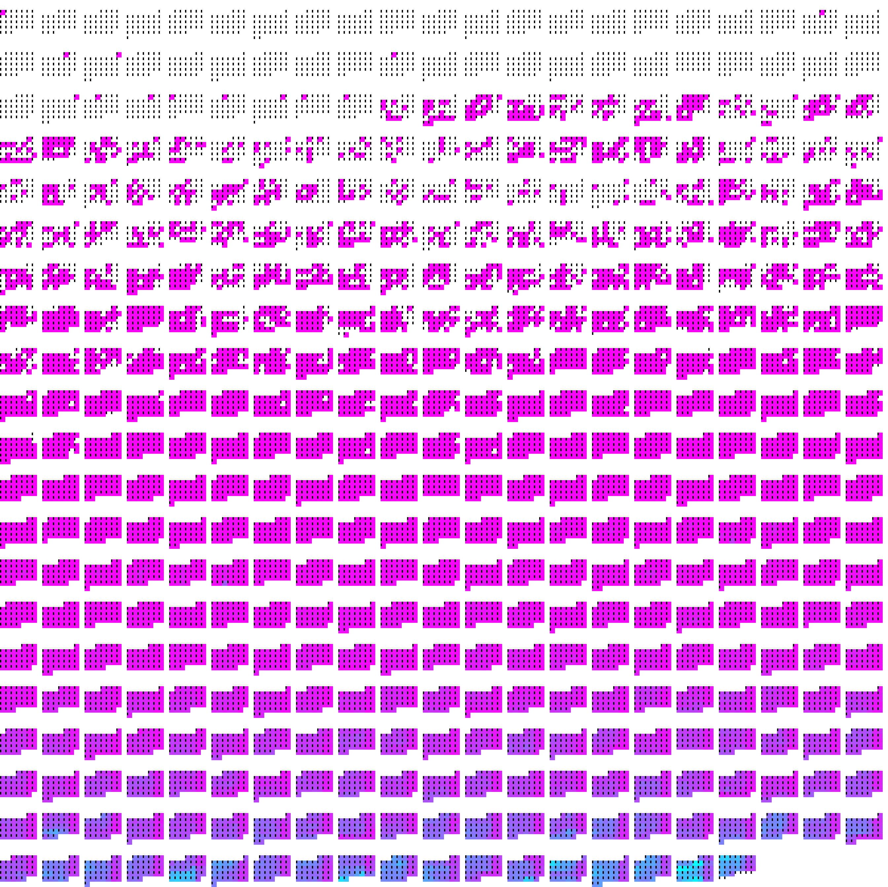
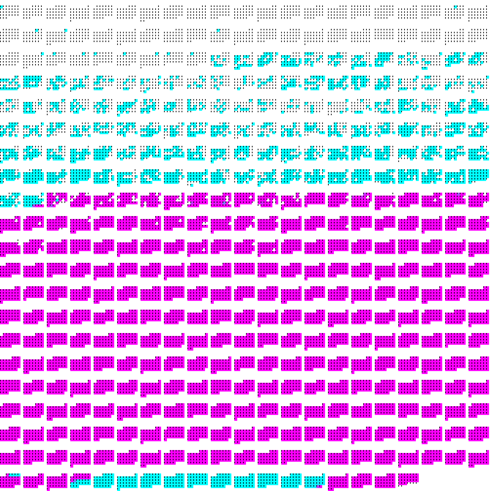

Firehose
========

*The academic news feed for completionists.*



Hundreds of machine learning papers are published to arXiv every day. ArXiv is
designed to email titles and abstracts of papers published under each category.
Historically, when machine learning was a smaller field, or for categories that
are lower volume to this day, subscribing to these lists was a sensible way to
keep up with research developments. But if you are a machine learning
researcher today, and you have the ambition to read every title published in
machine learning categories, you need a more streamlined and reliable tool to
keep track of what you have seen and what you haven't.

Firehose is that tool. Features:

* Maintains a local index of every paper posted to a set of arXiv categories
  and whether you have seen them,
* Streams titles/abstracts one at a time with a keyboard-driven terminal UI,
  with shortcuts for copying titles or downloading PDFs.
* Draws pretty pictures of how much of the arXiv backlog I've seen.

Why would anyone want to read every title published to ML arXiv? It's an
overwhelming amount of material, most of which is completely irrelevant and
some of which is slop. This is not for the faint of heart. If you prefer
precision over recall, you might want to use another tool:

* You could subscribe to topics on Google Scholar and get targeted
  recommendations soon after they are posted.
* You could wrangle the twitter algorithm into a crowdsourced paper feed.
* You could train an LLM to filter arXiv listings to match your taste.

But what if you want a keyboard-driven feed with shortcuts for downloading pdfs
or adding titles to reading lists? What if you want to gather your own
analytics data, rather than selling it to X.ai? What if you just want to see
things from a different perspective than most other people?

Above all, while reading hundreds of titles every day can be somewhat
exhausting, it's also the only method that is *exhaustive.* You can't get to
the end of twitter. When you get to the end of the day's arXiv posts, nothing
can surprise you.

Caveats:

* If you spend 2 seconds reading every title, you'll likely still miss some
  relevant papers. Recall isn't perfect.
* This is a personal research tool, shaped tightly around my own workflow and
  aesthetics. It isn't in package managers and I make no promises of support
  (but the code is simple and hackable, especially for AI agents).

Usage
-----

From mid April 2025 to February 2026, I scanned all of the 100,000 titles
published in computer science and machine learning categories.




About 2.5 percent of these papers seemed broadly relevant to my research
interests enough to file in my reading list.

For a smaller number of papers highly relevant to my active projects or those
of my colleagues, I saw these papers first and only using this tool.

Installation
------------

Clone the repo and install it into a Python 3.11+ environment. I recommend
[uv](https://docs.astral.sh/).

```
git clone https://github.com/matomatical/firehose
cd firehose
uv venv venv
source venv/bin/activate
uv pip install -e .
```

This pulls in a handful of small dependencies including my terminal plotting
library [matthewplotlib](https://github.com/matomatical/matthewplotlib) for the
visualisations.

For copying titles to the clipboard or opening papers in a browser, the tool
will try a few options in order depending on your platform, or fail to copy if
none are available:

* MacOS:
  * Clipboard: `pbcopy` (built in).
  * Opener: `open` (built in).
* Linux:
  * Clipboard: `wl-copy`, `xclip`, or `xsel`.
  * Opener: `xdg-open`.
* Windows: Not supported.

Configuration
-------------

Modify `config.toml`. It ships with sensible defaults and should be
self-documenting.

Every key in the shipped file is required (else the script might crash), so the
easiest way to start is to edit the one that's already there.

* `arxiv.categories` is the list of categories you subscribe to, as arXiv OAI
  "setSpecs" in colon form (e.g. `cs:cs:AI`, `stat:stat:ML`). For reference,
  `firehose classes` prints arXiv's full catalog of setSpecs and names.

  (Note: Changing this list invalidates your cache and requires you delete it
  and re-run `firehose harvest`, see below).

* `paths.data` controls where the index and logs live.

  Can be overridden at run-time with `--data-dir`.

* `paths.downloads` controles where PDFs are downloaded.
  
  Can be overridden at run-time with `--download-dir`.

* `scan.modern_cutoff` is a backstop for scanning. If you never want to see
  papers before the date you started scanning, set this.

You can override the path to the config file in the code or with
`--config-path`.

Usage
-----

First time usage after installation:

* Configure categories in `config.toml`.
* Run `firehose harvest` (needs a couple hours) to download local index of
  arxiv ids in your categories.

Daily usage:

* Run `firehose harvest` (needs <1min) to update local index of arxiv ids
* Run `firehose sample <n<` to launch the terminal UI scanner and scan the
  latest *n* papers (see `--help` for more options).
* Run `firehose calendar` or other subcommands to marvel at your progress.

### `harvest`: build the index

`firehose harvest` creates and updates `data/arxiv.txt`: the id and submission
date of every paper in your subscribed categories. Entries are grouped by date,
to keep the file small and greppable:

```
latest datestamp: 2026-03-05
1990-01-01:
cs/9301111
1991-08-01:
cs/9301113
...
2026-03-05:
2603.04402
2603.04417
```

Firehose uses arXiv's
  [Open Archives Initiative (OAI-PMH)](https://info.arxiv.org/help/oa/index.html)
API rather than the regular web API: it returns 3,500 records per request,
which is much faster than using the web API. The *first* run still takes a few
hours to chew through arXiv's enormous backlog, but after that, daily runs take
less than a minute.

Known issues:

* The long first harvest can crash. On a keyboard interrupt or an exception
  I've anticipated it saves its progress and can simply be restarted.
  If you hit a *new* crash, well, sorry! Catch it and send a patch.

* There's a persistent crash somewhere around 2006 that I never got to the
  bottom of. If you hit it, modify the arxiv date to restart from a few days
  earlier.

### `sample`: scan abstracts

`firehose sample [N]` downloads metadata for the latest `N` unread papers
(default 100) and presents them one at a time.

Each paper shows its title, authors, categories, abstract, and any comment,
with a progress bar and a live "seconds per paper" dwell timer along the top.
Simply advancing to a paper marks it as read, so it won't appear again in
future samples.

**Controls:**

| key         | action                                                          |
|-------------|-----------------------------------------------------------------|
| `→` / `←`   | next / previous paper                                           |
| `↑` / `o`   | open the paper's abstract page in your browser                  |
| `↓`         | cycle unmarked → save → download                                |
| `s`         | save: copy `- ? Author+Year Title` to the clipboard             |
| `d`         | download: copy `- Author+Year Title` *and* fetch the PDF        |
| `x`         | undo the save/download on this paper (deletes downloaded PDF)   |
| `space`     | pause / resume the dwell timer                                  |
| `q` / `esc` | quit                                                            |

A blank / `☆` / `★` mark in the top-right shows the current
unmarked/saved/downloaded state of the current paper this session.

**Saving to a reading list:**

Save and download operations copy a markdown list item to your clipboard. The
next step is to paste this into your reading list manager of choice. The format
is my own custom format:

```
- [?] <Key> <Title>
| |   |     |
'—|---|-----|-- Markdown list marker (`-` for unread paper, `+` for read paper)
  '---|-----|-- Optional `?` for a paper I don't yet have as a PDF on my disk
      '-----|-- A custom author-year key string for searching
            '-- The title of the paper
```

I paste these into a free-form markdown reading list manager which is how I
keep track of the literature.

**Choosing what to scan:**

By default `sample` shows the newest unread papers first. Some flags change the
selection:

| flag                 | effect                                                      |
|----------------------|--------------------------------------------------------|
| `firehose sample 50` | scan 50 papers instead of 100                          |
| `--no-modern`        | include papers older than `[scan].modern_cutoff`       |
| `--backwards`        | oldest unread first, instead of newest                 |
| `--randomise`        | a random sample of unread papers                       |
| `--no-query`         | just show the selection's date calendar, no API call   |

Every view, save, download, and removal is also appended as a timestamped event
to `data/scanlog.jsonl`, which supports later analysis of your scanning habits
and taste for papers.

### `classes`: list arXiv categories

`firehose classes` prints arXiv's full catalog of category setSpecs and names
(fetched live), to help you fill in `arxiv.categories` in the config file.
arXiv's taxonomy doesn't change often (though I think they could definitely use
some more categories).

### Visualising your reading

Firehose can render visualisations of the index and read log to the terminal:

* **`calendar`**: a heatmap of your reading by date. `--mode read-date`
  (default) colours days by how many titles you scanned; `--mode submit-date`
  colours the submission dates of papers you've read; `--mode proportion` shows
  what fraction of each day's papers you've seen.

* **`days`**: draws the same kind of heatmap over the submission dates of
  *every* indexed paper, giving a nice picture of arXiv's historical growth in
  your categories.

* **`linear`**: your progress through the entire index, in batches of 100
  papers, along with the total percentage read.

* **`hilbert`**: the whole index laid out along a Hilbert curve, lit up where
  you've read. `--live` redraws every few seconds, so you can leave it running
  in one pane and watch it fill while you scan in another.

  This one is large, I recommend using `--size 8` to clip to the most recent
  4^8 = 65k submissions and zooming out a little.

There's also `months` and `years` which print plain-text counts by group,
useful to get an idea of historical volume.


Data files
----------

Everything firehose knows lives in plain text under `data/`, all greppable and
hand-editable:

* **`arxiv.txt`**: the index: a `latest datestamp:` watermark, then bare paper
  ids grouped under `<date>:` (submission-date) headers. Written by `harvest`.
* **`readlog.txt`**: the seen-index, in the same grouped format (by the date
  you viewed each paper). `sample` appends to it so you never see a paper
  twice.
* **`scanlog.jsonl`**: an append-only event log, one JSON object per line
  (`{"t": ..., "type": "view"|"save"|"download"|..., "xid": ...}`), recording
  each scanning session for later analysis.

`data/` is gitignored by default, so your reading history never lands in the
code repo, and it's created automatically on first run.

However, this folder becomes highly valuable after some usage: the index takes
hours to harvest and the read log is irreplaceable. I keep my `data/` under its
own private git repo, but any method of backing up will do.

Contributing
------------

### glhf

I designed the tool to be simple and tailored to my own workflow. I'm only
releasing it because people sometimes ask about it.

I'm mostly not interested in maintaining this tool as a community project, and
will likely ignore PRs unless they seem useful to my own workflow specifically
and don't add too much complexity. I do appreciate people flagging objective
bugs.

I tried to keep the tool as simple and hackable as possible. I totally support
anyone forking it, hacking on it, and tailoring it to their own workflow.


### Tests

Install the test extra and run the suite:

```
pip install -e ".[test]"
pytest
```
The tests live in `tests/` and touch neither the network nor your `data/`, so
they're safe to run any time.

### Roadmap

For my own usage, I am considering adding other venues other than arXiv. This
will require quite deep refactoring of the tool.

* [ ] major ML conference proceedings.
* [ ] lesswrong/alignment forum.
* [ ] arbitrary RSS feeds.
* [ ] substack, medium, maybe custom blogs.
* [ ] maybe twitter, specific accounts (these days this is not free).

