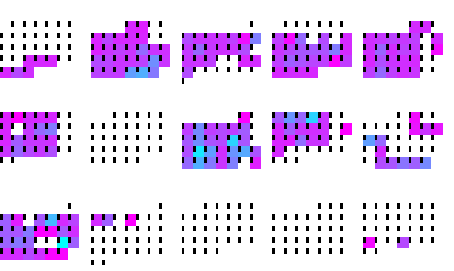
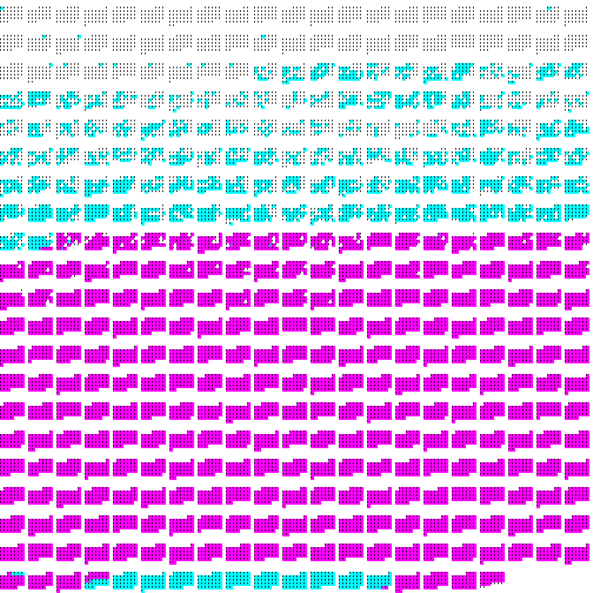
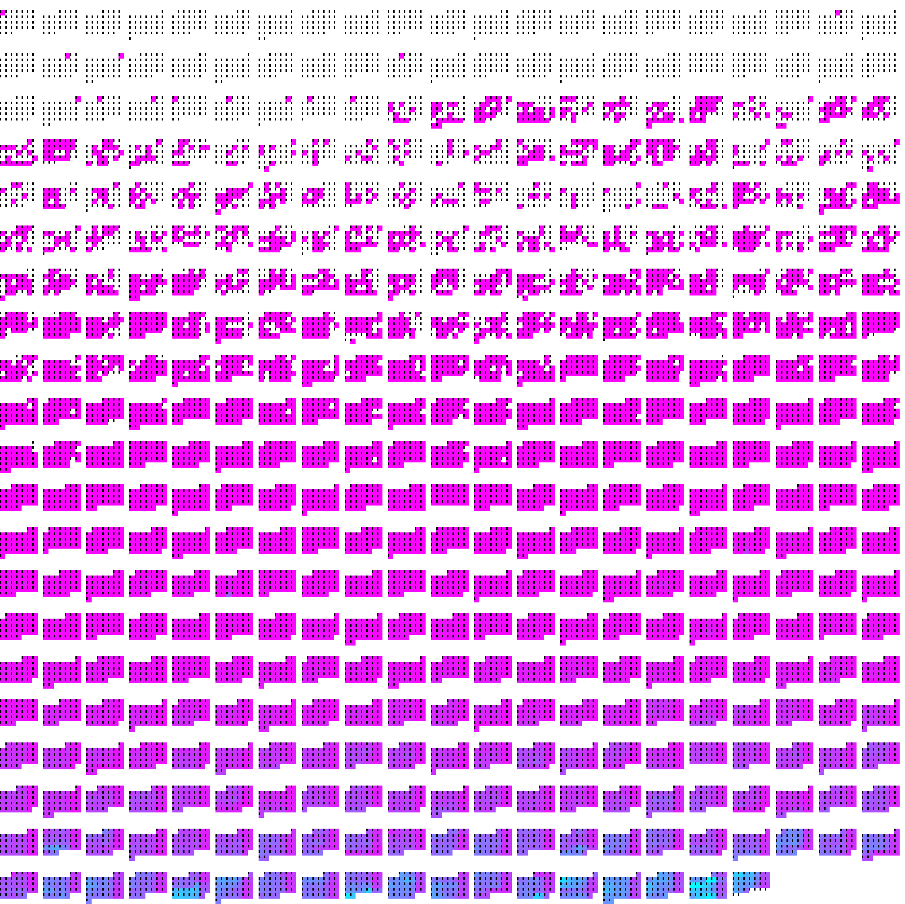
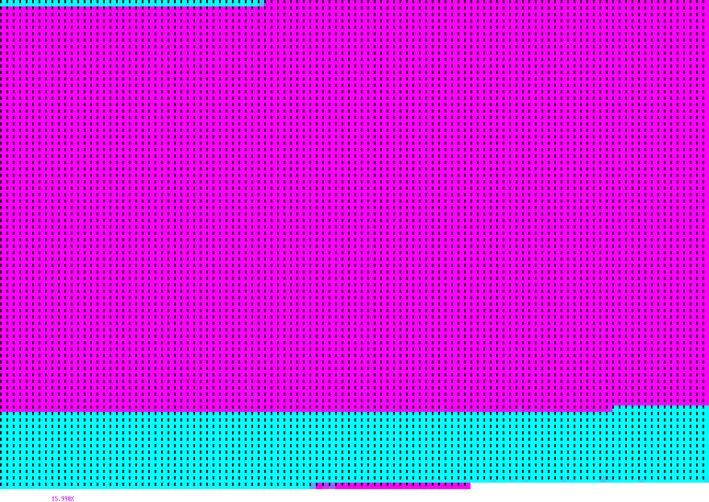

Firehose
========

*The academic news feed for completionists.*

Hundreds of machine learning papers are published to arXiv every day. ArXiv is
designed to email titles and abstracts of papers published under each category.
Historically, when machine learning was a smaller field, or for categories that
are lower volume to this day, subscribing to these lists was a sensible way to
keep up with research developments. But if you are a machine learning
researcher today, and you have the ambition to read every title published in
machine learning categories, you need a more streamlined and reliable tool to
keep track of what you have seen and what you haven't.

Firehose is that tool. Features:

* Maintains a local index of every paper posted to a set of arXiv categories
  and whether you have seen them,
* Streams titles/abstracts one at a time with a keyboard-driven terminal UI,
  with shortcuts for copying titles or downloading PDFs.
* Draws pretty pictures of how much of the arXiv backlog I've seen.

Motivation
----------

Wait, why would anyone want to read every title published to ML arXiv? It's an
overwhelming amount of material, most of which is completely irrelevant and
some of which is slop. This is not for the faint of heart. If you prefer
precision over recall, you might want to use another tool:

* You could subscribe to topics on Google Scholar and get targeted
  recommendations soon after they are posted.
* You could wrangle the twitter algorithm into a crowdsourced paper feed.
* You could train an LLM to filter arXiv listings to match your taste.

But what if you want a keyboard-driven feed with shortcuts for downloading pdfs
or adding titles to reading lists? What if you want to gather your own
analytics data, rather than selling it to X.ai? What if you just want to see
things from a different perspective than most other people?

Above all, while reading hundreds of titles every day can be somewhat
exhausting, it's also the only method that is *exhaustive.* You can't get to
the end of twitter. When you get to the end of the day's arXiv posts, nothing
can surprise you.

Caveats:

* If you spend 2 seconds reading every title, you'll likely still miss some
  relevant papers. Recall isn't perfect.
* This is a personal research tool, shaped tightly around my own workflow and
  aesthetics. It isn't in package managers and I make no promises of support
  (but the code is simple and hackable, especially for AI agents).

My usage
--------

From mid April 2025 to late February 2026, I scanned around 120,000 titles
published in computer science and machine learning categories.

Here is a visualisation of the volume of reading each day:



The colour indicates the number of titles I scanned (magenta: 1, cyan: 2.4k,
blank: zero). I took the last few months off due to some deadlines and travel,
but now I'm getting back into it as of today.

I spend somewhere around 4 seconds per title on average, including time to
dwell on interesting abstracts and download/file away useful papers into my
reading list, suggesting reading 120k titles took me about 130 hours. I just
started tracking more granular timing information so will get a precise picture
of this going forward.

So much time, what did I gain?

* About 2.5 percent of the papers I saw seemed broadly relevant to my research
  interests enough to file in my reading list, keeping my mental model of the
  literature up to date as new directions emerge.

* For a smaller number of papers highly relevant to my active projects or those
  of my colleagues, I saw these papers first and only using this tool and was
  able to rapidly share this information.

* I developed a fairly visceral sense of the volume and depth of work in modern
  machine learning, in a way that seems important for my intellectual
  development but I'm not yet able to articulate.

* When I was using the tool, I felt really powerful and like nothing could
  surprise me. On the flip side, when I fell behind, it felt overwhelming to
  start again.

I think I can sustainably commit to spending about 30 minutes a day on this
going forward, which should be enough to keep up with new papers until another
half-doubling or so of the rate of papers being published.

Installation
------------

Clone the repo and install it into a Python 3.11+ environment. I recommend
[uv](https://docs.astral.sh/).

```
git clone https://github.com/matomatical/firehose
cd firehose
uv venv venv
source venv/bin/activate
uv pip install -e .
```

This pulls in a handful of small dependencies including my terminal plotting
library [matthewplotlib](https://github.com/matomatical/matthewplotlib) for the
visualisations.

For copying titles to the clipboard or opening papers in a browser, the tool
will try a few options in order depending on your platform, or fail to copy if
none are available:

* MacOS:
  * Clipboard: `pbcopy` (built in).
  * Opener: `open` (built in).
* Linux:
  * Clipboard: `wl-copy`, `xclip`, or `xsel`.
  * Opener: `xdg-open`.
* Windows: Not supported.

Configuration
-------------

Modify `config.toml`. It ships with sensible defaults and should be
self-documenting.

Every key in the shipped file is required (else the script might crash), so the
easiest way to start is to edit the one that's already there.

* `arxiv.categories` is the list of categories you subscribe to, as arXiv OAI
  "setSpecs" in colon form (e.g. `cs:cs:AI`, `stat:stat:ML`). For reference,
  `firehose classes` prints arXiv's full catalog of setSpecs and names.

  (The metadata mirror stores all of arXiv regardless of this list, so you can
  change your subscription at any time and it takes effect immediately.)

* `paths.data` controls where the index and logs live. A relative path is
  resolved from the directory holding `config.toml`, so firehose finds the
  same data wherever you run it from.

  Can be overridden at run-time with `--data-dir` (resolved from the current
  directory).

* `paths.downloads` controls where PDFs are downloaded. A relative path is
  resolved from the directory holding `config.toml`.

  Can be overridden at run-time with `--download-dir` (resolved from the
  current directory).

* `scan.modern_cutoff` is a backstop for scanning. If you never want to see
  papers before the date you started scanning, set this.

* `server.url`, when set, makes every command query a remote firehose server
  (see the `serve` section) instead of local data files. An explicit
  `--data-dir` still means the local files at that path. `server.listen_host`
  and `server.listen_port` are where `firehose serve` itself listens.

You can override the path to the config file in the code or with
`--config-path`.

Usage
-----

First time usage after installation:

* Configure categories in `config.toml`.
* Run `firehose mirror` (needs several hours) to download a local mirror of
  arXiv metadata.
* Set up separate private git repo inside the data/ folder to save your
  progress (see the data files section for what to track).

Daily usage:

* Run `firehose mirror` (needs <1min) to pull new and updated records into
  the local mirror.
* Run `firehose sample <n>` to launch the terminal UI scanner and scan the
  latest *n* papers (see `--help` for more options).
* **Important:** Update git tracking of the data/ folder to save your progress.
* Run `firehose calendar` or other subcommands to marvel at your progress.

### `mirror`: build the local metadata mirror

`firehose mirror` creates and updates a full local mirror of arXiv paper
metadata (all categories, ~3M papers, ~2GB on disk): one gzipped JSON-lines
archive per submission month under `data/metadata/`, plus a derived
plain-text index (`data/index.txt`) of every paper's id, submission date,
and categories. Everything else — scanning, selection, the visualisations —
runs against this local mirror, so nothing but `mirror` itself ever touches
the network for metadata.

Firehose uses arXiv's
  [Open Archives Initiative (OAI-PMH)](https://info.arxiv.org/help/oa/index.html)
API rather than the regular web API: it returns 3,500 records per request,
which is much faster than using the web API. The *first* run still takes a few
hours (about five) to chew through arXiv's enormous backlog, but after that,
daily runs take less than a minute. Runs checkpoint as they go and resume from
where they left off, so an interrupted first run (or a flaky connection) just
means running it again.

### `sample`: scan abstracts

`firehose sample [N]` selects the latest `N` unread papers (default 100) from
the local mirror and presents them one at a time.

Each paper shows its title, authors, categories, abstract, and any comment,
with a progress bar and a live "seconds per paper" dwell timer along the top.
Simply advancing to a paper marks it as read, so it won't appear again in
future samples.

**Controls:**

| key         | action                                                          |
|-------------|-----------------------------------------------------------------|
| `→` / `←`   | next / previous paper                                           |
| `↑` / `o`   | open the paper's abstract page in your browser                  |
| `↓`         | cycle unmarked → save → download                                |
| `s`         | save: copy `- ? Author+Year Title` to the clipboard             |
| `d`         | download: copy `- Author+Year Title` *and* fetch the PDF        |
| `x`         | undo the save/download on this paper (deletes downloaded PDF)   |
| `space`     | pause / resume the dwell timer                                  |
| `q` / `esc` | quit                                                            |

A blank / `☆` / `★` mark in the top-right shows the current
unmarked/saved/downloaded state of the current paper this session.

**Saving to a reading list:**

Save and download operations copy a markdown list item to your clipboard. The
next step is to paste this into your reading list manager of choice. The format
is my own custom format:

```
- [?] <Key> <Title>
| |   |     |
'—|---|-----|-- Markdown list marker (`-` for unread paper, `+` for read paper)
  '---|-----|-- Optional `?` for a paper I don't yet have as a PDF on my disk
      '-----|-- A custom author-year key string for searching
            '-- The title of the paper
```

The `saved` / `downloaded` state records the action in Firehose even when no
clipboard is available (as is common in a headless SSH session). The action
message reports either `(copied to clipboard)` or `(clipboard not available)`
so clipboard delivery is never ambiguous.

I paste these into a free-form markdown reading list manager which is how I
keep track of the literature.

**Choosing what to scan:**

By default `sample` shows the newest unread papers first. Some flags change the
selection:

| flag                 | effect                                                      |
|----------------------|--------------------------------------------------------|
| `firehose sample 50` | scan 50 papers instead of 100                          |
| `--no-modern`        | include papers older than `[scan].modern_cutoff`       |
| `--backwards`        | oldest unread first, instead of newest                 |
| `--randomise`        | a random sample of unread papers                       |
| `--no-query`         | just show the selection's date calendar, then exit     |

Every view, save, download, and removal is appended as a timestamped event to
`data/events.jsonl`. This event log is the record of what you have seen (a
viewed paper never appears in a future sample) and supports later analysis of
your scanning habits and taste for papers.

### `serve`: run one mirror for several machines

`firehose serve` exposes a machine's data (mirror, index, event log) over
HTTP. Point another machine's `server.url` config at it and every firehose
command there — scanning, calendars, the lot — runs against the server's
data with no local mirror at all: selection happens server-side, events post
back in the background (so scanning never waits on the network; anything
undeliverable is saved to `data/unsent-events.jsonl` and reported), and
client startup is instant since the index lives in the server's memory.

This is how I run firehose day to day: the mirror and harvesting live on an
always-on mini PC, and my laptop scans against it over a
[Tailscale](https://tailscale.com/) network. Two things to know:

* **There is no authentication.** Bind the server to an interface that is
  itself the trust boundary — a tailnet address, a LAN you trust, or
  localhost. Never a public interface.
* The server loads the index once at startup; restart it after a `mirror`
  run so it sees new papers.

### `status`: check on the mirror

`firehose status` prints a snapshot of the store: the mirror's watermark and
size, subscribed and seen paper counts, the event log's tail, and the recent
harvest runs (each `mirror` run appends what it did to `data/harvests.jsonl`).
In remote mode the snapshot is the server's, so it answers "when did the
mirror last catch up with arXiv?" from any machine.

### `classes`: list arXiv categories

`firehose classes` prints arXiv's full catalog of category setSpecs and names
(fetched live), to help you fill in `arxiv.categories` in the config file.
arXiv's taxonomy doesn't change often (though I think they could definitely use
some more categories).

### Visualising your reading

Firehose can render visualisations of the index and event log to the terminal:

* **`calendar`**: a heatmap of your reading by date. `--mode read-date`
  (default) colours days by how many titles you scanned; `--mode submit-date`
  colours the submission dates of papers you've read; `--mode proportion` shows
  what fraction of each day's papers you've seen.

  

* **`days`**: draws the same kind of heatmap over the submission dates of
  *every* indexed paper, giving a nice picture of arXiv's historical growth in
  your categories.

  

* **`linear`**: your progress through the entire index, in batches of 100
  papers, along with the total percentage read.

  

* **`hilbert`**: the whole index laid out along a Hilbert curve, lit up where
  you've read. `--live` redraws every few seconds, so you can leave it running
  in one pane and watch it fill while you scan in another.

  This one is large, I recommend using `--size 8` to clip to the most recent
  4^8 = 65k submissions and zooming out a little.
  
  

* **`time`**: how long you've spent scanning, read back from the scan log
  (`events.jsonl`). Prints a per-day table of sessions run, papers seen, time
  spent, and seconds per paper, with a grand-total row, then (unless
  `--no-heatmap`) a calendar tinted by each day's scanning time (magenta = none,
  cyan = the busiest day, above a matching colour key). Dwell is the wall-clock between
  log events with paused spans excluded, and "per paper" counts distinct papers
  seen — the same figure `sample` shows live.

There's also `months` and `years` which print plain-text counts by group,
useful to get an idea of historical volume.

Data files
----------

Everything firehose knows lives in plain files under `data/`, all greppable
and hand-editable:

* **`metadata/`**: the mirror: one gzipped JSON-lines archive per submission
  month (`metadata/<YYMM>.jsonl.gz`), one document per line holding a
  paper's title, authors, abstract, categories, comments, and per-version
  dates. Written by `mirror`; readable with the usual line tools
  (`zgrep 2507.12345 data/metadata/2507.jsonl.gz` returns the whole
  document, `zcat ... | jq` pretty-prints a month).
* **`index.txt`**: derived from the mirror: a `latest datestamp:` watermark,
  then each paper's id and categories grouped under `<date>:`
  (submission-date) headers. Rebuildable at any time with
  `firehose rebuild-index`.
* **`events.jsonl`**: an append-only event log, one JSON object per line
  (`{"t": ..., "type": "view"|"save"|"download"|..., "xid": ...}`), recording
  each scanning session. This is the canonical record of your reading.
* **`harvests.jsonl`**: an operational log of `mirror` runs, one line per run
  (when it ran, what it applied, the watermark it reached). This is what
  `status` reads back; unlike the event log it's disposable.

`data/` is gitignored by default, so your reading history never lands in the
code repo, and it's created automatically on first run.

The event log becomes highly valuable after some usage: it is small and
irreplaceable, so back it up. I keep mine under its own private git repo
(with the mirror and index gitignored — they're bulky and rebuildable from
arXiv by re-running `mirror`), but any method of backing up will do.

Contributing
------------

### glhf

I designed the tool to be simple and tailored to my own workflow. I'm only
releasing it because people sometimes ask about it.

I'm mostly not interested in maintaining this tool as a community project, and
will likely ignore PRs unless they seem useful to my own workflow specifically
and don't add too much complexity. I do appreciate people flagging objective
bugs.

I tried to keep the tool as simple and hackable as possible. I totally support
anyone forking it, hacking on it, and tailoring it to their own workflow.


### Tests

Install the test extra and run the suite:

```
pip install -e ".[test]"
pytest
```
The tests live in `tests/` and touch neither the network nor your `data/`, so
they're safe to run any time.

### Roadmap

For my own usage, I am considering adding other venues other than arXiv. This
will require quite deep refactoring of the tool.

* [ ] major ML conference proceedings.
* [ ] lesswrong/alignment forum.
* [ ] arbitrary RSS feeds.
* [ ] substack, medium, maybe custom blogs.
* [ ] maybe twitter, specific accounts (these days this is not free).
